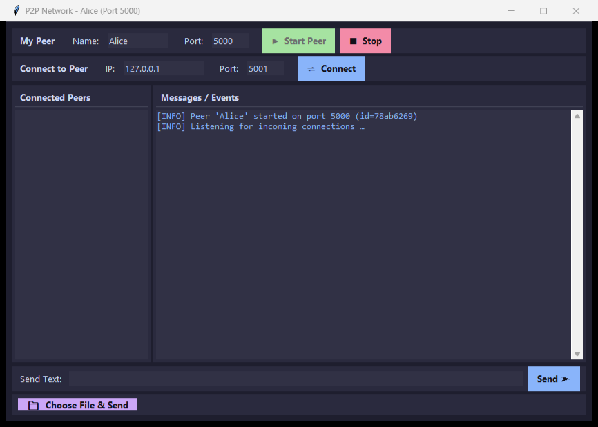
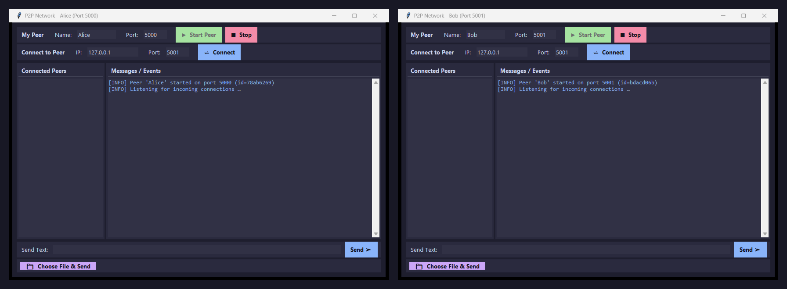
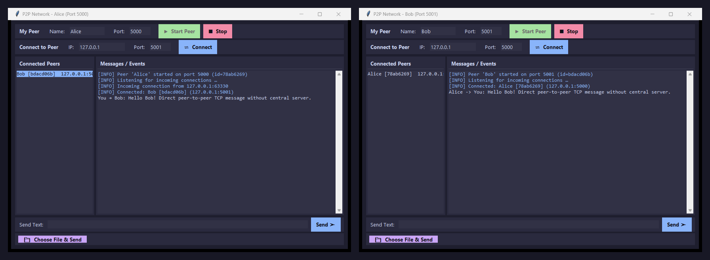
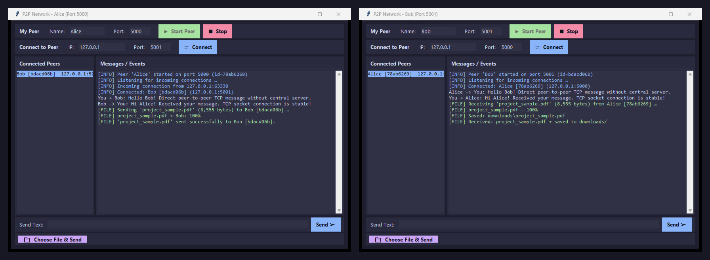
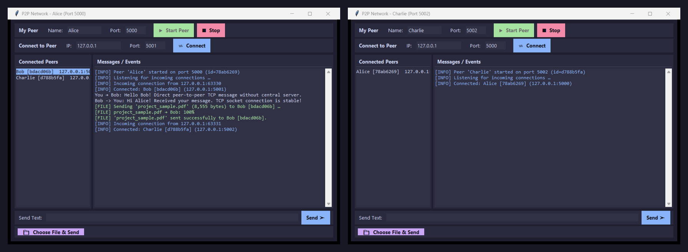

# Peer-to-Peer Network Communication and File Sharing

**Course:** CSE 433 — Blockchain & Distributed Security Lab  
**Department:** Department of Computer Science and Engineering  
**Institution:** University of Asia Pacific (UAP)  
**Programming Language:** Python 3.9+ (Standard Library only)  
**Communication:** TCP Sockets  

---

## 1. Project Description

This project implements a lightweight **Peer-to-Peer (P2P)** communication and file-sharing network in Python using pure TCP sockets and multi-threading. Unlike traditional client-server architectures where all traffic flows through a central coordinator, every running instance of this application acts as an independent **peer** that simultaneously performs both roles:

1. **Server Role:** Listens on a dedicated TCP port and accepts incoming connections from other peers.
2. **Client Role:** Connects directly to remote peers using their IP address and port number.

```
Traditional Client-Server Architecture:
   Client A  ───>  [ Central Server ]  <───  Client B

Peer-to-Peer (P2P) Architecture:
   Peer A  <────────────────────────────────>  Peer B
     ▲                                           ▲
     │                                           │
     └─────────────>  Peer C  <──────────────────┘
```

Peers establish direct TCP sockets, execute an identity handshake (`hello` / `hello_ack`), and can concurrently exchange plain-text messages and arbitrary binary files (images, audio, video, PDFs, ZIP archives, etc.) without relying on any intermediary server.

---

## 2. Requirements

### Software Requirements
- **Python:** Version 3.9 or later (compatible with Python 3.9, 3.10, 3.11, 3.12, 3.13)
- **Dependencies:** **None (Standard Library only)**
  - `socket` — Network endpoint creation and TCP streaming
  - `threading` — Concurrent connection handling and non-blocking background transfers
  - `struct` — Packing/unpacking 4-byte network byte-order (big-endian) length headers
  - `json` — Serialization and deserialization of application-level message payloads
  - `os`, `uuid` — File path operations, downloads directory management, and unique peer identification
  - `tkinter` — Graphical User Interface (GUI)
- **Supported Operating Systems:** Windows, Linux, macOS

### Hardware & Network Requirements
- **Single-Machine Testing:** Any computer running multiple application windows on loopback (`127.0.0.1`).
- **Multi-Computer Testing:** Two or more computers connected to the same Local Area Network (LAN) or Wi-Fi network.

---

## 3. Installation / Setup Instructions

1. **Clone or Download the Repository:**
   ```bash
   git clone https://github.com/YeasinJoy/P2P_Network.git
   cd P2P_Network
   ```
   *(Or extract the submitted ZIP file and navigate into the project directory).*

2. **Verify Python Installation:**
   Make sure Python 3.9 or higher is installed and added to your system PATH:
   ```bash
   python --version
   ```

3. **Check Dependencies:**
   No external packages or `pip install` commands are needed. You can verify `requirements.txt`:
   ```bash
   cat requirements.txt
   ```

4. **Verify Project Structure:**
   ```
   P2P_Network/
   │
   ├── main.py          # Graphical User Interface (Tkinter) and event loop
   ├── p2p_node.py      # Core P2P networking layer (TCP Server, Client, Threading)
   ├── protocol.py      # Application protocol, message framing, chunked I/O
   ├── requirements.txt # Dependency specifications (Standard Library only)
   ├── README.md        # Project documentation and user guide
   │
   └── downloads/       # Auto-created folder where received files are stored
   ```

---

## 4. How to Run the Application

Launch a peer instance by running:

```bash
python main.py
```

To run multiple peers on the same machine, open separate terminal windows and run `python main.py` in each window.

---

## 5. How to Connect Two Peers

Every peer on the same computer must use a **unique port number** (e.g., `5000`, `5001`, `5002`).

### Step-by-Step Connection Walkthrough

#### Step 1: Start Peer 1 (e.g., Alice)
1. In the first terminal, launch `python main.py`.
2. In the **My Peer** section:
   - **Name:** `Alice`
   - **Port:** `5000`
3. Click **▶ Start Peer**.
4. The event log displays:
   ```
   [INFO] Peer 'Alice' started on port 5000 (id=a83f21c4)
   [INFO] Listening for incoming connections …
   ```

#### Step 2: Start Peer 2 (e.g., Bob)
1. In a second terminal, launch `python main.py`.
2. In the **My Peer** section:
   - **Name:** `Bob`
   - **Port:** `5001`
3. Click **▶ Start Peer**.

#### Step 3: Establish Connection
1. In Bob's window, navigate to the **Connect to Peer** section:
   - **IP:** `127.0.0.1` (or the LAN IP if testing across two PCs)
   - **Port:** `5000` (Alice's listening port)
2. Click **⇌ Connect**.
3. The nodes execute a two-way handshake (`hello` and `hello_ack`):
   - Alice introduces herself to Bob; Bob introduces himself to Alice.
   - **Alice** shows `Bob [92bd71e3] 127.0.0.1:5001` in her **Connected Peers** list.
   - **Bob** shows `Alice [a83f21c4] 127.0.0.1:5000` in his **Connected Peers** list.

#### Testing Across Different Computers on the Same LAN / Wi-Fi
1. Find Computer A's local IPv4 address using `ipconfig` (Windows) or `ifconfig` / `ip a` (Linux/Mac) (e.g., `192.168.1.15`).
2. Start Peer A on Computer A on port `5000`.
3. Start Peer B on Computer B on port `5000`.
4. On Computer B, enter IP `192.168.1.15` and Port `5000`, then click **⇌ Connect**.

---

## 6. How to Transfer Files

The application handles all files as raw binary data streams, supporting text files, images (`.png`, `.jpg`), audio (`.mp3`, `.wav`), video (`.mp4`, `.mkv`), documents (`.pdf`), and archives (`.zip`).

### File Transfer Steps:

1. **Select Recipient:** Click on the target peer in the **Connected Peers** listbox on the left panel (e.g., select `Bob`).
2. **Choose File:** Click the purple **📁 Choose File & Send** button.
3. **Select File:** A native file-selection dialog opens. Browse and select any file from your computer.
4. **Sending Process:**
   - The sender transmits a JSON metadata message specifying `filename` and exact `filesize`.
   - The file is then streamed in **64 KiB chunks** to avoid excessive memory consumption.
   - Progress is logged at intervals (0%, 25%, 50%, 75%, 100%).
5. **Receiving Process:**
   - The recipient's receiver thread parses the metadata to determine the incoming byte count.
   - The recipient reads exactly `filesize` bytes and saves them into the `downloads/` directory.
   - If a file with the same name already exists, the application appends an incremented suffix (`_1`, `_2`) to prevent data loss.
   - A success message appears: `[FILE] Received: photo.jpg → saved to downloads/`.

### Sending Text Messages:
1. Select the destination peer from the **Connected Peers** list.
2. Type a message in the **Send Text** input box.
3. Click **Send ➤** or press `Enter`.
4. The message instantly appears in both peers' event log without passing through any server.

---

## 7. Example Screenshots

Actual screenshots captured from the running application demonstrating all key requirements of the assignment:

### 7.1 Peer Startup and Server Initialization
Starting Peer **Alice** on TCP listening port `5000`. The server socket binds to `0.0.0.0:5000`, generates a unique session ID (`78ab6269`), and enters the listening loop ready to accept incoming connections.



---

### 7.2 Connecting Two Peers (Handshake Established)
Peer **Bob** starts on port `5001` and connects to Alice at `127.0.0.1:5000`. The two peers perform the automatic two-way `hello` and `hello_ack` handshake. Both peers immediately appear in each other's **Connected Peers** listbox with their IP and listening port.



---

### 7.3 Two-Way Text Messaging
Alice selects Bob and sends a direct text message. Bob receives it in real time and sends a reply back to Alice. Both messages appear in the respective communication logs without passing through any central server.



---

### 7.4 Binary File Transfer (Chunked Streaming & Verification)
Alice selects a binary document (`project_sample.pdf`) and transmits it to Bob. The transfer sends JSON metadata first, followed by the raw binary stream in 64 KiB chunks with percentage progress logging. Bob receives and verifies the full byte stream, saving it safely into the `downloads/` directory.



---

### 7.5 Multi-Peer Network (3-Peer Mesh Demonstration)
A third peer (**Charlie** on port `5002`) joins the network, connecting to Alice and Bob. Alice maintains multiple concurrent socket threads, listing both Bob and Charlie simultaneously in her **Connected Peers** roster.



---

## 8. Protocol and Architecture Details

### Message Framing
TCP delivers an unstructured byte stream. To preserve application message boundaries, every JSON packet uses a **4-byte length prefix** (big-endian unsigned integer) preceding the JSON payload:

```
+------------------------+---------------------------------------+
|  4-Byte Length (N)     |  JSON Payload (N bytes UTF-8)         |
+------------------------+---------------------------------------+
```

### Supported Message Types
- `hello`: Handshake introduction containing `peer_id`, `peer_name`, and listening `port`.
- `hello_ack`: Handshake response to confirm mutual connection.
- `text`: Chat payload with `sender_id`, `sender_name`, and `message`.
- `file`: File metadata message (`filename`, `filesize`) immediately preceding raw binary bytes.
- `disconnect`: Graceful notification before closing a socket.

### Multi-Threading Model
- **Server Accept Thread:** Listens and accepts incoming peer connections.
- **Peer Receiver Threads:** Each active connection runs a dedicated daemon thread to continuously read incoming frames.
- **Background File Sender Threads:** Prevents UI freezing during multi-megabyte binary transfers.
- **Thread-Safe UI Updating:** Background threads dispatch GUI modifications via Tkinter's `root.after()` queue.

---

## 9. Viva / Defense Q&A Quick Reference

| Question | Answer Summary |
|---|---|
| **Why can a peer act as both client and server?** | It runs a listening socket server to accept connections and creates client sockets to connect out to others. |
| **Why is TCP used instead of UDP?** | TCP guarantees ordered, error-checked, reliable delivery, ensuring files arrive without missing or corrupt bytes. |
| **What is message framing?** | Prefixing each message with its byte length so the receiver knows exactly how many bytes constitute a complete message. |
| **Why send file metadata before file bytes?** | The receiver must know the filename and exact byte length to know when to stop reading and where to save the file. |
| **Why are files transmitted in chunks?** | Prevents RAM exhaustion when sending large media files and allows progressive status logging. |
